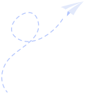
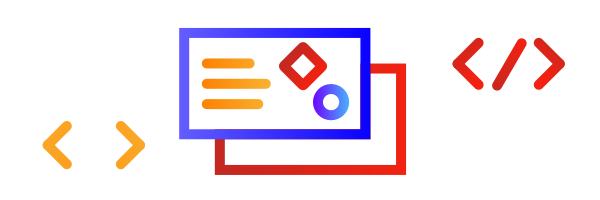
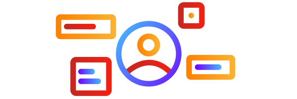
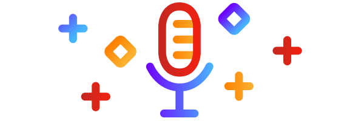
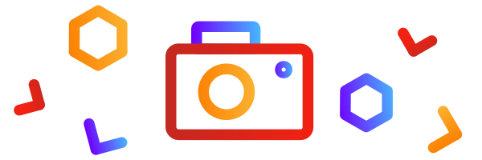
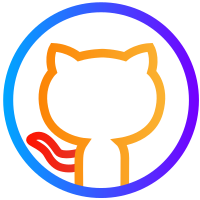
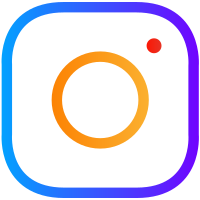

<h1 align="center"> Hi, I'm Alex! 👋</h1>

    <h3 align="center"> </h3>
     
     
    <h2 align="left">💻 About me </h2> 
    <ul>
        <li>
            🔭 Aspiring Front-End Developer 
        </li>
        <li>
            🌱 Currently learning: React
        </li>
        <li>
            :bulb: Creative coder
        </li>
        <li>
            🗣 Public speaker  
        </li>
        <li>
            🔥️ Challenge seeker
        </li>
    </ul>

 
 
 
 
<h2 align="left"> :zap: What I do</h2>
 

    <table>
        <tr>
            <td>
            
                <h3 align="center">
                    Software Development
                </h3>
                

                    Learning software development allows me to be creative, solve problems and have new ideas.
                

            </td>
            <td>
                
                 <h3 align="center">
                    UI & UX Design
                </h3>
                

                    I enjoy creating digital experiences centered on the users and their interactions.
                

            </td>
            <td>
                
                 <h3 align="center">
                    Public speaking
                </h3>
                

                    Public speaking allows me to meet new people and keeps me engaged, motivated and creative.
                

            </td>
            <td>
                
                 <h3 align="center">
                    Photography
                </h3>
                

                    Photography lets me capture and immortalise the most imporant moments in my life.
                

            </td>
        </tr>
    </table>

<h2 align="left"> :speech_balloon: Let's talk!</h2>
    <h3 align="center">
        :sparkles:
        <a href="https://alexnastase.com">
            alexnastase.com
        </a>
        :sparkles:
    </h3>

<a href="https://github.com/AlexandruNst">
<a href="https://www.linkedin.com/in/alexandrunst/">
<a href="https://www.instagram.com/alexandru.codes/">

<!--
**AlexandruNst/AlexandruNst** is a ✨ _special_ ✨ repository because its `README.md` (this file) appears on your GitHub profile.

Here are some ideas to get you started:

- 🔭 I’m currently working on ...
- 🌱 I’m currently learning...
- 👯 I’m looking to collaborate on...
- 🤔 I’m looking for help with...
- 💬 Ask me about...
- 📫 How to reach me:...
- 😄 Pronouns:...
- ⚡ Fun fact: ...
  -->
